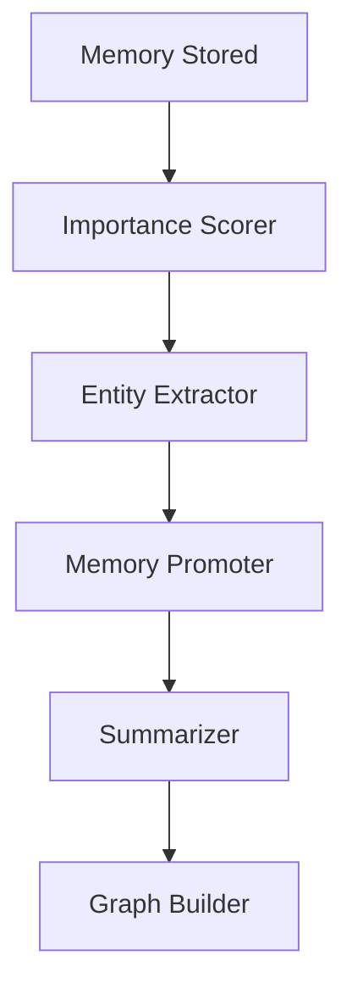

# Phase 2 Architecture - Intelligence Layer

## Overview

Phase 2 adds autonomous intelligence to the memory system through background workers that continuously improve memory organization, extract insights, and maintain system health.

## Components

### Background Workers

| Worker                | Schedule     | Function                                                                                   |
| --------------------- | ------------ | ------------------------------------------------------------------------------------------ |
| **Importance Scorer** | Every 5 min  | Recalculates importance scores based on content, source, engagement, and context           |
| **Entity Extractor**  | Every 15 min | Extracts code entities (functions, classes, imports), file references, and technical terms |
| **Memory Promoter**   | Hourly       | Promotes memories between tiers and archives low-value ones                                |
| **Summarizer**        | Daily 2 AM   | Summarizes long-term memories using Claude API                                             |
| **Graph Builder**     | Daily 3 AM   | Builds entity relationships via co-occurrence analysis                                     |

## Data Flow



## Memory Lifecycle

```
NEW MEMORY (tier: short)
    ↓
SHORT-TERM (< 2 days)
    ↓ importance >= 0.7 OR access_count >= 2
WORKING MEMORY
    ↓ age > 30 days AND low access
LONG-TERM (summarized)
    ↓ importance < 0.3 AND unaccessed
ARCHIVED
```

## Configuration

Key settings in `.env`:

- `WORKERS_ENABLED`: Enable/disable workers
- `CLAUDE_API_KEY`: For summarization (optional)
- `SHORT_TERM_DAYS`: Duration before promotion (default: 2)
- `WORKING_TERM_DAYS`: Duration before summarization (default: 30)

## Monitoring

```bash
# Check worker status
npm run workers:monitor

# View logs
tail -f data/worker_manager.log

# Start/stop
npm run workers:start
npm run workers:stop
```
