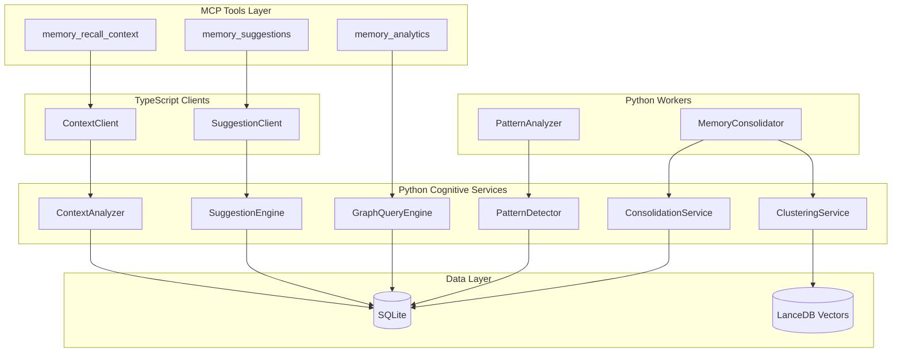

# Phase 3 Architecture - Cognitive Features

## Overview

Phase 3 transforms the MCP Agent Memory Pro system into a cognitive agent with proactive intelligence capabilities. The cognitive layer sits on top of the existing Phase 1 (Foundation) and Phase 2 (Intelligence Workers) implementations.

## Architecture Diagram



## Components

### Cognitive Services

| Service | Purpose | Key Methods |
|---------|---------|-------------|
| **GraphQueryEngine** | Graph traversal and analysis | `find_related_entities()`, `get_central_entities()`, `find_communities()` |
| **ContextAnalyzer** | Current context detection | `analyze_current_context()`, `recall_relevant_memories()` |
| **SuggestionEngine** | Proactive recommendations | `generate_suggestions()`, `detect_potential_issues()` |
| **PatternDetector** | Pattern and anomaly detection | `detect_recurring_patterns()`, `identify_anomalies()`, `track_trends()` |
| **ClusteringService** | Memory clustering | `cluster_memories()`, `reduce_dimensions()` |
| **ConsolidationService** | Memory deduplication | `find_duplicates()`, `merge_memories()`, `garbage_collect()` |

### Workers

| Worker | Schedule | Function |
|--------|----------|----------|
| **MemoryConsolidator** | Daily | Merges duplicates, garbage collects low-value memories |
| **PatternAnalyzer** | Hourly | Detects patterns, stores insights as memories |

### MCP Tools

| Tool | Input | Output |
|------|-------|--------|
| `memory_recall_context` | Optional project/file hints | Context analysis + recalled memories |
| `memory_suggestions` | Optional project filter | Suggestions, issues, forgotten knowledge |
| `memory_analytics` | Query type + filters | Graph stats, patterns, trends, or entity info |

## Data Flow

### Context Recall Flow

```
1. User invokes memory_recall_context
2. ContextClient analyzes recent memories (30 min window)
3. Identifies: active projects, entities, context type
4. Queries older memories matching context
5. Scores by relevance and returns top matches
```

### Suggestion Flow

```
1. User invokes memory_suggestions
2. SuggestionEngine checks:
   - Forgotten high-importance memories
   - Unresolved TODOs
   - Repeated errors
   - Relevant best practices
3. Scores and ranks suggestions
4. Returns actionable recommendations
```

## Configuration

Phase 3 uses the same `.env` configuration as Phase 1/2, with optional additions:

```bash
# Cognitive settings (optional)
CONTEXT_WINDOW_MINUTES=30    # Default context window
FORGOTTEN_THRESHOLD_DAYS=14  # Days before surfacing as forgotten
```

## Dependencies

See `python/requirements-cognitive.txt`:

- `networkx` - Graph algorithms
- `scikit-learn` - Clustering
- `hdbscan` - Density clustering (optional)
- `umap-learn` - Dimensionality reduction (optional)
